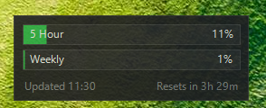

# Claude Usage Widget

A lightweight Windows desktop widget that displays your Claude.ai usage limits in real-time.



## Features

- **5-Hour Usage** - Shows your rolling 5-hour message limit utilization
- **Weekly Usage** - Shows your 7-day usage percentage
- **Smart Refresh** - Polls more frequently when usage is high
- **Desktop Docking** - Snaps to screen edges, stays on desktop
- **Minimal Footprint** - Single ~280KB executable, no dependencies

## Quick Start

1. Download `ClaudeWatch.exe` from Releases (or build from source)
2. Run the executable
3. Right-click the widget → **Set Cookie...**
4. Follow the instructions to paste your session cookie
5. Widget displays your current usage

## Getting Your Session Cookie

1. Open [claude.ai](https://claude.ai) in your browser
2. Press **F12** to open Developer Tools
3. Go to **Application** → **Cookies** → **claude.ai**
4. Find the cookie named `sessionKey`
5. Copy its value (starts with `sk-ant-`)
6. In the widget, right-click → **Set Cookie...** → Click OK → Paste (Ctrl+V)

> **Note:** The session cookie expires periodically. When you see "Auth expired", repeat these steps to update it.

## Building from Source

### Requirements

- Windows 10/11
- Visual Studio 2022 (or Build Tools)
- CMake 3.16+

### Build Steps

```batch
git clone https://github.com/horizonip/ClaudeWatch.git
cd ClaudeWatch
mkdir build && cd build
cmake .. -G "Visual Studio 17 2022"
cmake --build . --config Release
```

The executable will be at `build/Release/ClaudeWatch.exe`

### MinGW Alternative

```batch
mkdir build && cd build
cmake .. -G "MinGW Makefiles" -DCMAKE_BUILD_TYPE=Release
cmake --build .
```

## Usage

### Controls

| Action | Effect |
|--------|--------|
| **Drag** | Move widget (snaps to edges) |
| **Right-click** | Open context menu |
| **Double-click** | Open claude.ai in browser |

### Context Menu

- **Refresh Now** - Force immediate usage refresh
- **Set Cookie...** - Configure your session cookie
- **Always On Top** - Toggle window staying above others
- **Open Claude.ai** - Launch claude.ai in default browser
- **Exit** - Close the widget

### Command Line

```batch
# Normal mode
ClaudeWatch.exe

# Demo mode (test with fake data)
ClaudeWatch.exe --demo
```

## Configuration

Settings are stored in `%APPDATA%\ClaudeWatch\config.ini`

```ini
[Auth]
SessionCookie=sk-ant-sid01-...

[Window]
PosX=1650
PosY=50
AlwaysOnTop=1
Opacity=90

[Refresh]
SmartRefresh=1
MinIntervalSec=60
MaxIntervalSec=600

[Display]
ShowResetTime=1
```

### Configuration Options

| Setting | Default | Description |
|---------|---------|-------------|
| `PosX`, `PosY` | 100 | Window position |
| `AlwaysOnTop` | 1 | Keep widget above other windows |
| `Opacity` | 90 | Window transparency (0-100) |
| `SmartRefresh` | 1 | Adjust refresh rate based on usage |
| `MinIntervalSec` | 60 | Fastest refresh interval (seconds) |
| `MaxIntervalSec` | 600 | Slowest refresh interval (seconds) |

### Smart Refresh

When enabled, refresh interval adjusts based on your usage:

| Usage Level | Refresh Interval |
|-------------|------------------|
| < 50% | 10 minutes |
| 50-80% | 5 minutes |
| > 80% | 1 minute |

## Color Coding

The progress bars change color based on usage:

| Usage | Color | Meaning |
|-------|-------|---------|
| < 50% | 🟢 Green | Plenty of capacity |
| 50-80% | 🟡 Yellow | Moderate usage |
| > 80% | 🔴 Red | Approaching limit |

## Troubleshooting

### "Auth expired - update cookie"

Your session cookie has expired. Get a fresh one from claude.ai (see [Getting Your Session Cookie](#getting-your-session-cookie)).

### "Could not get org ID"

The widget couldn't retrieve your organization info. Check:
- Your cookie is correct and not truncated
- You have an active Claude.ai subscription
- claude.ai is accessible

### Widget shows wrong data

Check the debug file at `%APPDATA%\ClaudeWatch\debug_response.txt` to see the raw API response.

### Widget won't start

Ensure you have the Visual C++ Runtime installed. Download from [Microsoft](https://aka.ms/vs/17/release/vc_redist.x64.exe).

## Technical Details

### API Endpoints

The widget uses these Claude.ai API endpoints:

1. `GET /api/organizations` - Retrieve organization UUID
2. `GET /api/organizations/{uuid}/usage` - Fetch usage data

### Response Format

```json
{
  "five_hour": {
    "utilization": 93.0,
    "resets_at": "2026-02-04T21:00:00.490897+00:00"
  },
  "seven_day": {
    "utilization": 55.0,
    "resets_at": "2026-02-09T18:00:00.490918+00:00"
  }
}
```

### Dependencies

All Windows built-in (no external libraries):

- `WinHTTP.lib` - HTTP requests
- `GDIPlus.lib` - Anti-aliased rendering
- `Shlwapi.lib` - Path utilities
- `Comctl32.lib` - Common controls

## Project Structure

```
ClaudeWatch/
├── CMakeLists.txt
├── README.md
├── src/
│   ├── main.cpp         # Entry point, window, message loop
│   ├── config.cpp/h     # INI configuration management
│   ├── http_client.cpp/h # WinHTTP wrapper
│   ├── parser.cpp/h     # JSON response parsing
│   ├── ui.cpp/h         # GDI+ rendering
│   └── resource.h       # Resource IDs
├── res/
│   └── app.rc           # Windows resources
└── docs/
    └── plans/           # Design documents
```

## License

MIT License - see LICENSE file

## Disclaimer

This is an unofficial tool and is not affiliated with Anthropic. It relies on undocumented Claude.ai web APIs which may change without notice. Use at your own risk.
